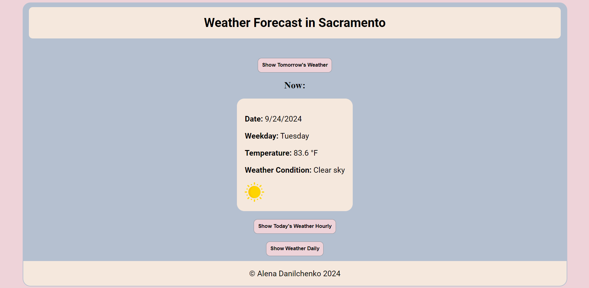

# alena-dan-open-api



## Overview
This project displays the current weather, hourly forecast, and weather predictions for tomorrow and the day after tomorrow in Sacramento, using the **Open-Meteo API**. It provides a user-friendly interface for monitoring weather data, including temperature, max and min temperature, weather condition, day or night time.

You can view the live project here: [Live Demo](https://anelka777.github.io/alena-dan-open-api/)

## Features
- Displays current weather information for Sacramento.
- Provides an hourly weather forecast.
- Shows weather data for tomorrow and the day after tomorrow.
- Retrieves weather data from the Open-Meteo API.
- User-friendly and responsive design.

## Technologies Used
- **HTML5**: Structure of the webpage.
- **CSS3**: Styling and layout, including responsive design.
- **JavaScript (ES6+)**: Fetching and processing weather data from the API.
- **Open-Meteo API**: Weather data provider.

## How It Works
1. The application fetches weather data for Sacramento from the Open-Meteo API.
2. The data is processed to display the current weather, tomorrow's weather, and an hourly forecast.
3. The user interface updates dynamically based on the retrieved data.

## Installation and Usage
1. Clone this repository:
   ```bash
   git clone https://github.com/Anelka777/alena-dan-open-api.git